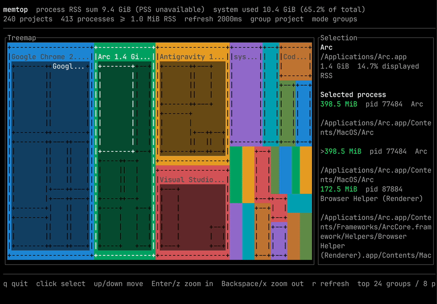

# memtop

<p align="center">
  
</p>

<p align="center">
  <strong>Project-aware process memory for your terminal.</strong><br>
  Memory grouped the way developers think: by app, repo, container, and workspace.
</p>

<p align="center">
  <a href="https://github.com/kimdwkimdw/memtop/releases"></a>
  
  
  
</p>

`memtop` is a live TUI treemap for Linux and macOS process memory. Instead of showing a flat list of `node`, `python`, `cargo`, browser helpers, and worker processes, it groups memory by the project or app those processes belong to.

```text
224.2 MiB   2.1%  memtop  (~/dev/private/memtop)
 143.9 MiB         codex --yolo
  28.3 MiB         node .../codex
   6.8 MiB         target/debug/memtop --once
```



## Install

Install from npm, then run `memtop` from any shell:

```bash
npm install -g @arthurkim/memtop
memtop
```

Check the installed command:

```bash
memtop --version
```

The npm tarball bundles prebuilt native binaries for:

- `aarch64-apple-darwin`
- `x86_64-apple-darwin`
- `aarch64-unknown-linux-musl`
- `x86_64-unknown-linux-musl`

## Usage

Run the live treemap:

```bash
memtop
```

Print a non-interactive snapshot:

```bash
memtop --once
```

Useful filters:

```bash
memtop --top-projects 40
memtop --top-processes 16
memtop --min-memory-kib 8192
memtop --interval-ms 1000
memtop --group-by uid
```

Choose a memory metric:

```bash
memtop --metric pss
memtop --metric uss
memtop --metric rss
```

## Why Grouping Matters

Modern development stacks rarely run as one obvious process. A single project can appear as:

- `node`
- `cargo`
- `python`
- `rust-analyzer`
- `tsserver`
- `worker`
- app bundle helper processes
- container children

`memtop` recovers that context before drawing the memory map, so you can see whether a repo, desktop app, browser, container, or worker group is responsible for memory growth.

## How Grouping Works

`memtop` inspects process working directories, command paths, executable paths, macOS app bundles, and container metadata.

It recognizes project markers:

```text
.git
Cargo.toml
package.json
pyproject.toml
go.mod
mise.toml
```

It also recognizes workspace-style paths:

```text
project
projects
repo
repos
src
workspace
workspaces
```

On macOS, processes from the same `/Applications/*.app`, `/System/Applications/*.app`, `/System/Library/CoreServices/*.app`, or `~/Applications/*.app` bundle are grouped together before repository fallback detection. That keeps apps such as Chrome and their helper processes under one app-level group.

Container metadata takes precedence when a process is known to belong to a container.

On Linux, `--group-by uid` groups processes by the real UID reported in `/proc/<pid>/status`. In the TUI, press `u` to toggle between project-aware grouping and UID grouping.

## Navigation

| Input | Action |
| --- | --- |
| `Up`, `Down`, `k`, `j` | Move through groups or processes |
| `Enter`, `z` | Zoom into the selected group |
| `Backspace`, `x` | Return to the group view |
| `u` | Toggle project/UID grouping |
| Mouse click | Select a project or process |
| `r` | Refresh now |
| `q`, `Esc` | Quit |

## Memory Metrics

On Linux, `pss` and `uss` come from `/proc/<pid>/smaps_rollup`.

- `pss` is usually the best attribution view because it divides shared pages across sharers.
- `rss` is fastest, but shared pages can be counted multiple times.
- `uss` focuses on private resident memory.

On macOS, the OS does not expose the same PSS/USS accounting through this CLI, so `memtop` uses RSS while preserving the same TUI and grouping behavior.

`--scan-threads` controls Linux PSS/USS collection cost. The default `4` keeps CPU usage bounded. Use `--scan-threads 0` to use all available parallelism for faster exact snapshots at higher CPU and memory cost.

## Limitations

On Linux, the first TUI frame can show inflated memory. This is intentional: when the requested metric is `pss` or `uss`, `memtop` opens with a fast RSS preview, then replaces it with the slower `smaps_rollup` result in the background.

Example from a real host:

```text
RSS preview: process RSS sum 979.6 GiB, system used 88.1 GiB
PSS refresh: process PSS sum  77.7 GiB, system used 88.7 GiB
```

The `979.6 GiB` preview is not host memory usage. It is the sum of per-process RSS, so shared pages are counted once for every process that maps them. In the same snapshot:

```text
training group: 963.9 GiB RSS -> 63.1 GiB PSS
training worker:  15.0 GiB RSS ->  1.5 GiB PSS
serving group:     2.9 GiB RSS ->  2.0 GiB PSS
serving worker:  692.6 MiB RSS -> 480.1 MiB PSS
```

The header has two totals with different meanings:

- `system used` comes from `/proc/meminfo` as `MemTotal - MemAvailable`. This is the kernel's host-wide memory pressure signal.
- `process <metric> sum` is the sum of sampled processes above `--min-memory-kib`. It drives treemap tile sizes. It is an attribution view, so it will not exactly match `system used`.

Reading Linux `smaps_rollup` is slower because the kernel must summarize memory mappings for each process. If `smaps_rollup` cannot be read, that process falls back to RSS.

## Development

Run from source:

```bash
pnpm install
pnpm start
```

Run a snapshot from source:

```bash
pnpm once
```

Build and test:

```bash
pnpm test
pnpm build
```

The package launchers are TypeScript sources compiled into `dist/bin/*.js` before each package script runs. In a release npm package, the CLI wrapper runs the bundled `vendor/<target>/memtop` binary. From a source checkout, it uses `target/release/memtop` after a release build and falls back to `cargo run` before that.

## Release

GitHub Releases are built from version tags. The release workflow also publishes `@arthurkim/memtop` to npm, so the repository must have an `NPM_TOKEN` secret with publish access to that package.

```bash
VERSION="$(node -p "require('./package.json').version")"
git tag -a "v${VERSION}" -m "Release v${VERSION}"
git push origin "v${VERSION}"
```

Pushing the tag starts the `release` workflow automatically. To rerun a release, run **Actions > release > Run workflow** and enter the existing tag.

The workflow publishes:

- `memtop-aarch64-apple-darwin.tar.gz`
- `memtop-x86_64-apple-darwin.tar.gz`
- `memtop-aarch64-unknown-linux-musl.tar.gz`
- `memtop-x86_64-unknown-linux-musl.tar.gz`
- npm package `@arthurkim/memtop`

Linux archives are MUSL builds for broader distro compatibility. They are smoke-tested on the Ubuntu build runner and inside an Alpine container before upload. The npm package is also smoke-tested with `npm install -g` before it is published.
